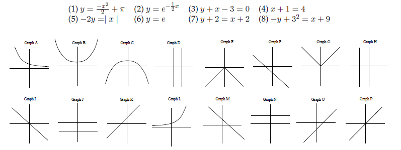

# Diagnostic Quiz 2: Algebraic Skills II

## Questions

### Question 1.
Determine equation of line with gradient $-4$ and point $(3,5)$. <br>
(A) $y=-4x+17$ <br>
(B) $y=-4x+7$ <br>
(C) $y=-4x-7$ <br>
(D) $y=-4x-17$ <br>
(E) $y=4x-17$ <br>
(F) None of the above

### Question 2.
Pick false statement for $y=-2$. <br>
(A) Horizontal line <br>
(B) y-intercept $-2$ <br>
(C) Intercepts $(4, -2)$ <br>
(D) Intercepts $(-2, 0)$ <br>
(E) Gradient $0$ <br>
(F) None of the above

### Question 3.
Determine the equation of the line with points $(1,1)$ and $(2,7)$. 

### Question 4.
Solve $\log_3{27}+\ln{e^2}$.

### Question 5.
Match the equation with the graph.



### Question 6.
Factorise $x^2-16x+64$. <br>
(A) $(x+8)(x+8)$ <br>
(B) $(x+4)(x+16)$ <br>
(C) $(x+4)(x-16)$ <br>
(D) $(x-8)(x-8)$ <br>
(E) $(x-16)(x+4)$ <br>
(F) None of the above

### Question 7.
Determine roots for the quadratic equation: $y=x^2+4x+3$. <br>
(A) $x=1,3$ <br>
(B) $x=-1,3$ <br>
(C) $x=-3,-1$ <br>
(D) $x=-3,1$ <br>
(E) $x=3,4$ <br>
(F) None of the above

### Question 8.
Solve simultaneous equations: $x+y=5$ and $3x+2y=6$. <br>
(A) $x=4$, $y=1$ <br>
(B) $x=2$, $y-3$ <br>
(C) $x=5$, $y=0$ <br>
(D) $x=3$, $y=2$ <br>
(E) $x=9$, $y=-4$ <br>
(F) None of the above

### Question 9.
Determine the angle of elevation: 12m tall tree that has a 20m shadow. <br>
Hint: $\arccos{\frac{12}{20}}\approx 15\degree$, $\arcsin{\frac{12}{20}}\approx 37\degree$ and $\arctan{\frac{12}{20}}\approx 31\degree$.

### Question 10.
Determine the equation of the line parallel to the line $y=-3x+1$ and point $(6,-15)$.

## Answers

### Question 1.
```math
\begin{aligned}
    y &= mx + c \\
    5 &= -4(3) + c \\
    5 &= -12 + c \\
    17 &= c \\
    c &= 17 \\ 
    y &= -4x + 17 \\
    \therefore \ A
\end{aligned}
```

### Question 2.
```math
\begin{aligned}
    \therefore \ D
\end{aligned}
```

### Question 3.
```math
\begin{aligned}
    m &= \frac{y_2-y_1}{x_2-x_1} \\
    &= \frac{7-1}{2-1} \\
    &= 6 \\
    y &= mx + c \\
    1 &= 6(1) + c \\
    1 &= 6 + c \\
    -5 &= c \\
    c &= -5 \\ 
    \therefore \ y = 6x - 5
\end{aligned}
```

### Question 4.
```math
\begin{aligned}
    \log_3{27} + \ln{e^2} &= \log_3{3^3} + 2\ln{e} \\
    &= 3\log_3{3} + 2 \\
    &= 3 + 2 \\
    &= 5 \\
    \therefore \ 5
\end{aligned}
```

### Question 5.
1. $C$
2. $A$
3. $M$
4. $D$
5. $G$
6. $N$
7. $P$
8. $I$

### Question 6.
```math
\begin{aligned}
    x^2-16x+64 &= (x-8)(x-8) \\
    \therefore \ D
\end{aligned}
```

### Question 7.
```math
\begin{aligned}
    y &= x^2+4x+3 \\
    y &= (x+3)(x+1) \\
    0 &= (x+3)(x+1) \\
    x+3 = 0, \quad x+1 = 0 \\
    x = -3, \quad x=-1 \\
    \therefore \ C
\end{aligned}
```

### Question 8.
```math
\begin{aligned}
    \text{(1)} x+y=5 \quad \text{(2)} 3x+2y=6 \\
    \text{(1)} x=5-y  \\
    \text{Substitute (1) into (2)} \\
    3(5-y)+2y &= 6 \\ 
    15-3y+2y &= 6 \\
    -y &=-9 \\
    y &= 9 \\
    x + y = 5 \\
    x + 9 = 5 \\
    x = -4 \\
    \therefore \ E
\end{aligned}
```

### Question 9.

### Question 10.
