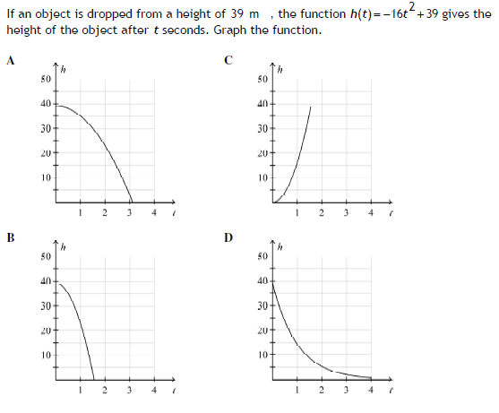

# Diagnostic Test 4: Quadratic Functions

## Questions

### Question 1.
Simplify and rationalise $\frac{x^2-2x-24}{x^2-5x-36}$. <br>
(A) $\frac{x-6}{x+9}$ <br>
(B) $\frac{x+6}{x+9}$ <br>
(C) $\frac{x+6}{x-9}$ <br>
(D) $\frac{x-6}{x-9}$

### Question 2.
Solve $(x+6)(x-2)=-7$. <br>
(A) $(-13, 5)$ <br>
(B) $(-6, 2)$ <br>
(C) $(-5, 1)$ <br>
(D) $(\frac{-7}{6}, \frac{7}{2})$

### Question 3.
Factorise $d^2-14d+49$. <br>
(A) $(d+7)^2$ <br>
(B) $(d-7)^2$ <br>
(C) $(d-7)(d+7)$ <br>
(D) $(d-49)(d-1)$

### Question 4.
Factorise $r^2-49$. <br>
(A) $(r-7)(r+7)$ <br>
(B) $(r+7)(r+7)$ <br>
(C) $(r-7)(r-7)$ <br>
(D) $(r-7)(r+9)$ 

### Question 5.
Factorise $k^2-16h^2$. <br>
(A) $(k+4h)(k+4h)$ <br>
(B) $(k-4h^2)(k+4)$ <br>
(C) $h^2(k+4)(k-4)$ <br>
(D) $(k+4h)(k-4h)$

### Question 6.
Solve $3z^2+3z-6=0$. <br>
(A) $z=1$ or $z=-2$ <br>
(B) $z=1$ or $z=2$ <br>
(C) $z=3$ or $z=-2$ <br>
(D) $z=3$ or $z=2$

### Question 7.
Solve $3x^2-x-3=0$. <br>
(A) $[1 \pm \sqrt{37}] / 6$ <br>
(B) $[1 \pm \sqrt{-35}] / 6$ <br>
(C) $[-1 \pm \sqrt{37}] / 6$ <br>
(D) $[-1 \pm \sqrt{37}] / 6$

### Question 8.
Factorise $x^2-x-12$. <br>
(A) $(x+3)(x-4)$ <br>
(B) $(x-3)(x+4)$ <br>
(C) $(x+2)(x-6)$ <br>
(D) $(x-2)(x+6)$

### Question 9.
Determine the axis of symmetry and the coordinates of the vertex for $y=4x^2+5x-1$. <br>
(A) $x=\frac{5}{8}; \text{vertex}:(\frac{5}{8},4\frac{5}{8})$ <br>
(B) $x=\frac{5}{8}; \text{vertex}:(\frac{5}{8},3\frac{11}{16})$ <br>
(C) $x=-\frac{5}{8}; \text{vertex}:(-\frac{5}{8},-5\frac{11}{16})$ <br>
(D) $x=-\frac{5}{8}; \text{vertex}:(-\frac{5}{8},-2\frac{9}{16})$

### Question 10.
Determine the graph of the equation: $h(t)=-16t^2+39$.


## Answers

### Question 1.
```math
\begin{aligned}
    \frac{x^2-2x-24}{x^2-5x-36} &= \frac{(x-6)(x+4)}{(x+4)(x-9)} \\
    &= \frac{x-6}{x-9} \\
    \therefore \ D
\end{aligned}
```


### Question 2.
```math
\begin{aligned}
    (x+6)(x-2)&=-7 \\
    x^2+6x-2x-12&=-7 \\
    x^2+4x-5&=0 \\
    (x+5)(x-1)&=0 \\
    x+5=0 \text{and} x-1=0 \\
    x=-5 \text{and} x=1 \\
    \therefore \ C
\end{aligned}
```

### Question 3.
```math
\begin{aligned}
    d^2-14d+49 &= (d-7)(d-7) \\
    &= (d-7)^2 \\
    \therefore \ B
\end{aligned}
```

### Question 4. 
```math
\begin{aligned}
    r^2-49 &=(r-7)(r+7) \\
    \therefore \ A
\end{aligned}
```

### Question 5.
```math
\begin{aligned}
    k^2-16h^2 &= (k+4h)(k-4h) \\
    \therefore \ D
\end{aligned}
```

### Question 6.
```math
\begin{aligned}
    3z^2+3z-6 &= 0
    3(z^2+z-2) &= 0 \\
    3(z+2)(z-1) &= 0 \\
    z+2=0 \text{and} z-1=0 \\
    z=-2 \text{and} z=1 \\
    \therefore \ A
\end{aligned}   
```

### Question 7.
```math
\begin{aligned}
    3x^2-x-3&=0 \\
    x^2-\frac{1}{3}x-1&=0 \\
    x^2-\frac{1}{3}x&=1 \\
    x^2-\frac{1}{3}x+(-\frac{\frac{1}{3}}{2})^2&=1+(-\frac{\frac{1}{3}}{2})^2 \\
    x^2-\frac{1}{3}x+(-\frac{1}{6})^2&=1+(-\frac{1}{6})^2 \\
    (x-\frac{1}{6})^2&=1+\frac{1}{36} \\
    (x-\frac{1}{6})^2&=\frac{37}{36} \\
    x-\frac{1}{6}&=\pm\frac{\sqrt{37}}{6} \\
    x&=\pm\frac{1+\sqrt{37}}{6} \\
    \therefore \ A
\end{aligned}
```

### Question 8.
```math
\begin{aligned}
    x^2-x-12 &= (x-4)(x+3) \\
    \therefore \ A
\end{aligned}
```

### Question 9.
```math
\begin{aligned}
x&=-\frac{b}{2a} \\
&=-\frac{5}{2*4} \\
&=-\frac{5}{8}
y&=4(-\frac{5}{8})^2+5(-\frac{5}{8})-1 \\
&=4(\frac{25}{64})-\frac{25}{8}-1 \\
&=\frac{25}{16}-\frac{25}{4}-1 \\
&=\frac{25}{16}-\frac{100}{16}-\frac{16}{16} \\
&=-\frac{91}{16} \\
&=-5\frac{11}{16} \\
\therefore \ C
\end{aligned}
```
